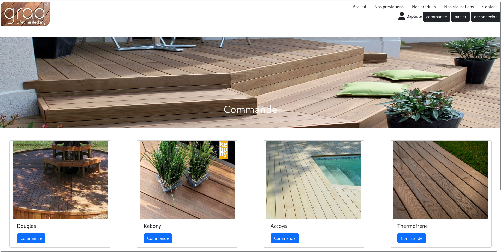

# GRAD 🚀 - Premier Projet de BTS SIO

Bienvenue dans **GRAD**, un projet développé dans le cadre de ma formation en **BTS Services Informatiques aux Organisations (SIO)**. 🎉



## Description du Projet 📝

**GRAD** est une application de gestion pour une terrasse en bois, conçue avec les fonctionnalités suivantes :

- Interface de gestion des utilisateurs
- Formulaire de contact
- Système de connexion
- Panier utilisateur

L'application utilise une base de données **MySQL** pour stocker et gérer dynamiquement les informations. C'est mon premier projet de développement informatique qui met en pratique mes connaissances théoriques en situation réelle. 🌱

## Objectifs du Projet 🎯

Les principaux objectifs de ce projet sont :

1. **Développement Applicatif**
   - Créer une application web fonctionnelle et complète
   - Implémenter des fonctionnalités de gestion utilisateur
   - Mettre en place un système de connexion sécurisé
   - Développer un panier d'achats interactif

2. **Gestion de Base de Données**
   - Utiliser MySQL pour stocker et manipuler les données
   - Gérer efficacement les informations des utilisateurs
   - Créer des relations de données robustes

## Installation & Prérequis 💻

### Prérequis Techniques

- MySQL
- Git


### Étapes d'Installation

#### 1. Base de Données

```bash
mysql -u [utilisateur] -p grad_db < base_de_donnees/initialisation.sql
```

#### 2. Configuration du Projet

```bash
git clone [url_du_depot]
cd grad


npm install
```


#### 3. Démarrage de l'Application

```bash
npm start 
```

## Fonctionnalités Principales ⚙️

- **Authentification Sécurisée**
  - Formulaire de connexion robuste
  - Gestion des sessions utilisateur

- **Gestion des Utilisateurs**
  - Ajout, modification, suppression d'utilisateurs
  - Consultation des profils et historiques

- **Interactions Utilisateur**
  - Formulaire de contact
  - Système de panier d'achats
  - Navigation intuitive

## Auteur 🧑‍💻

Réalisé par **BERNARD Baptiste**, étudiant en BTS Services Informatiques aux Organisations.